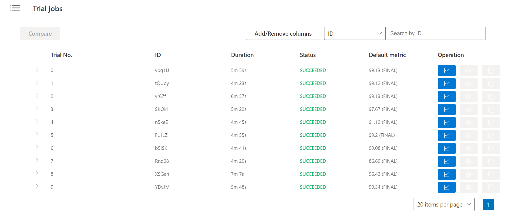
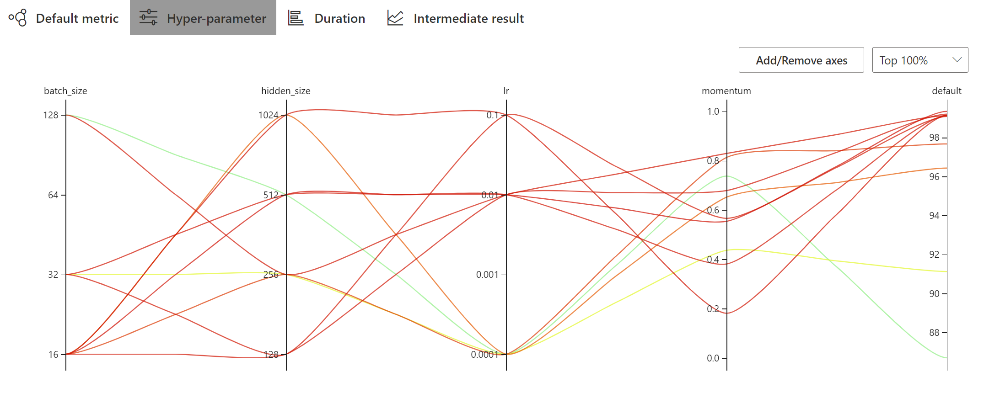
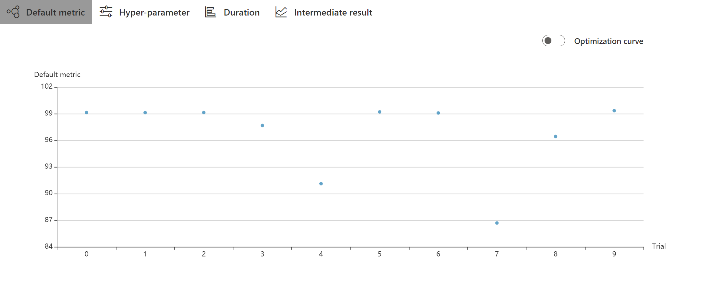
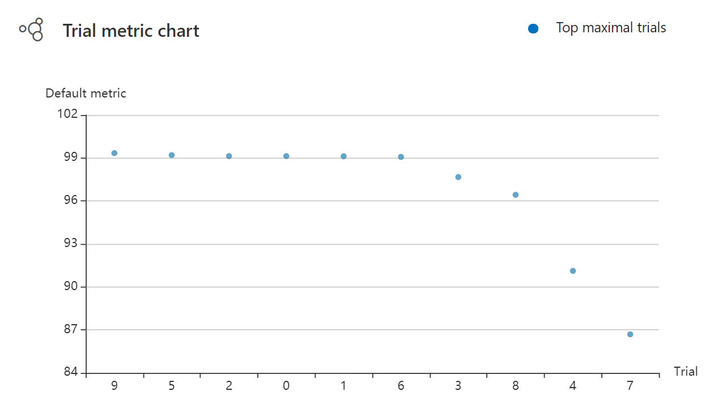
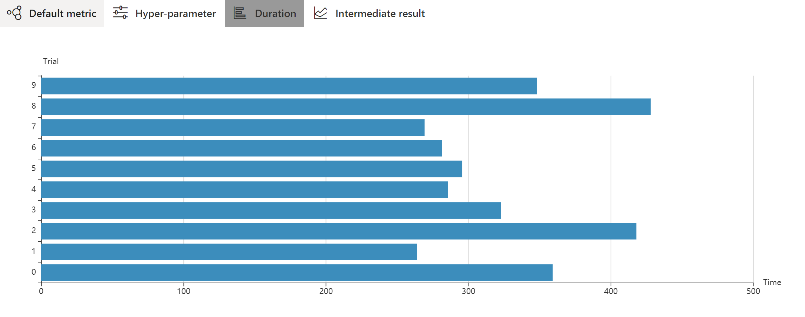
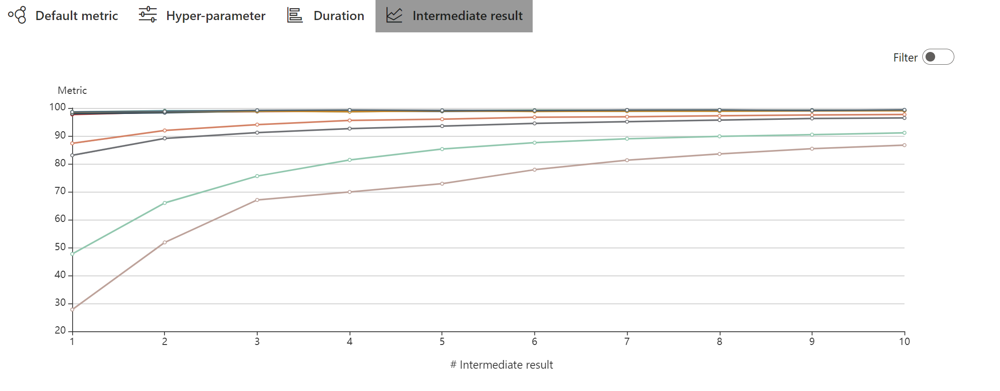

# Task 1 入门任务

## NNI 体验文档

### 1. AutoML 工具比较

机器学习算法与模型的选择，对机器学习十分重要，一个成功的选择，能够成倍提高训练效率，从而提高模型准确度，减少损失，产生更大的效益。

但算法与模型的选择并不简单。就算是数据科学家，也需要花费大量的时间用于尝试与权衡不同模型的优劣，最终才能得出理想的结果。超参的调参过程中也经常造成算力的浪费。

自动机器学习（AutoML）是一套自动化的机器学习应用工具，旨在用自动化工具完成特征工程、自动调参等优化工作。

当前，自动机器学习平台早已问世，下面介绍几个著名的AutoML工具，并列出优缺点，以供比较。

#### auto-sklearn

auto-sklearn是GitHub上开源的一个基于sklearn的自动机器学习工具，目前已获得5.1k个星。

优点：可限制训练时间，支持切分训练集和测试集，支持交叉验证。

缺点：输出信息较少，优化算法单一。

#### Google Cloud AutoML

Google Cloud AutoML基于高精度的深度神经网络而设计，可用于图像分类、自然语言处理、语音翻译等。

优点：具有较完整的谷歌ML生态链，Tensorflow+Colab+Cloud AutoML共同使用时非常方便。

优点：具有完整图形界面，对新手用户友好，同时提供API调用，分类详尽。

缺点：完整版需付费，访问需科学上网。

#### Microsoft NNI

NNI(Neural Network Intelligence)是微软亚洲研究院开源的自动机器学习工具，面向研究人员和算法工程师而设计，2018年9月问世，目前已经更新至v1.9。

优点：支持多平台，支持命令行操作，支持结果可视化。内置优化算法多，扩展性强，支持远程调用进行集群训练。

缺点：个人认为调试方面可以进一步改善。

更详细的对比：


（摘自MSRA官网）

### 2. NNI 安装及使用

NNI的安装非常简单，只需一行命令即可安装：

```
$ pip install --upgrade nni
```

本人强烈推荐将nni安装在Anaconda的环境中，可通过在PyCharm中设置Python解释器，实现对NNI的调用。

使用NNI，需要在原有神经网络代码的基础上做出些许修改：

1. 通过nni模块获得参数
2. 向nni报告中间结果
3. 向nni报告最终结果

修改好代码并且准备好搜索空间和配置文件后，就可以通过一行命令开始使用NNI：

```
$ nnictl create --config your-config.yml
```

具体会在下述代码部分进行解释。


### 3. NNI 使用感受

NNI易于安装，易于使用，有一套完善的命令行控制工具，也有结果可视化界面，对机器学习实验与研究提供了巨大的便利。

本人大一，尚未接触过多机器学习知识，但通过在本地跑通多个样例后，能感受到NNI在机器学习方面的威力，希望未来能够掌握NNI，方便未来的研究与学习。

## NNI 样例分析文档

### 配置文件：config_windows.yml

```
authorName: default
experimentName: example_mnist_pytorch
trialConcurrency: 1
maxExecDuration: 2h
maxTrialNum: 10
#choice: local, remote, pai
trainingServicePlatform: local
searchSpacePath: search_space.json
#choice: true, false
useAnnotation: false
tuner:
  #choice: TPE, Random, Anneal, Evolution, BatchTuner, MetisTuner, GPTuner
  #SMAC (SMAC should be installed through nnictl)
  builtinTunerName: TPE
  classArgs:
    #choice: maximize, minimize
    optimize_mode: maximize
trial:
  command: python mnist.py
  codeDir: .
  gpuNum: 0
```

### 搜索空间：search_space.json

```json
{
    "batch_size": {"_type":"choice", "_value": [16, 32, 64, 128]},
    "hidden_size":{"_type":"choice","_value":[128, 256, 512, 1024]},
    "lr":{"_type":"choice","_value":[0.0001, 0.001, 0.01, 0.1]},
    "momentum":{"_type":"uniform","_value":[0, 1]}
}
```
### 代码

代码部分只需要在原有PyTorch代码上进行些许修改。

1. 参数选择无需在程序中给定，而是通过nni获得：
```python
tuner_params = nni.get_next_parameter()
```

2. 在每个epoch学习完成后，报告中间结果：
```python
nni.report_intermediate_result(test_acc)
```

3. 在训练完整结束后，报告最终结果：
```python
nni.report_final_result(test_acc)
```


#### 结果

如图，10次trial都成功地完成，其中id为9的trial达到了最高准确率，达99.34%。




#### 超参组合可视化



图中，准确率更高的组合用红线表示，而准确率低的用绿线表示。

可以看出，当batch_size选择16，lr和momentum大小适中时，模型可以达到99%以上的准确率，实验效果非常理想。

#### 训练结果可视化








