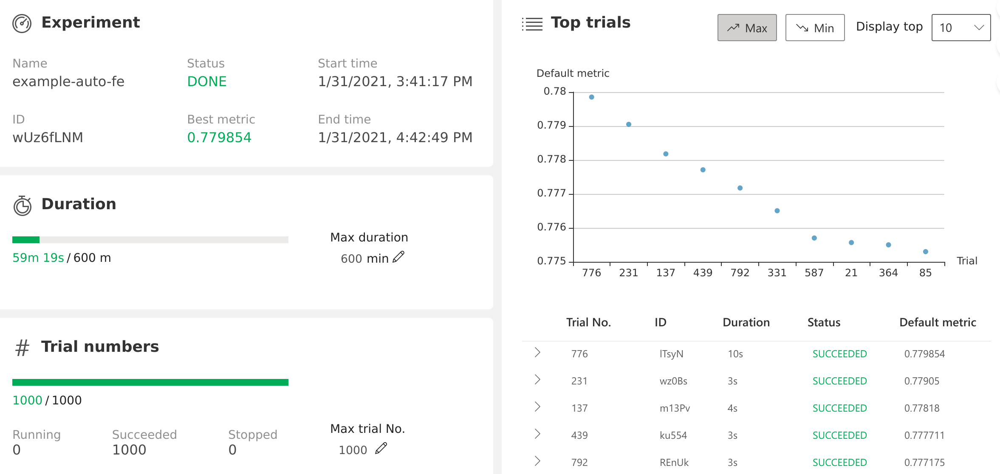
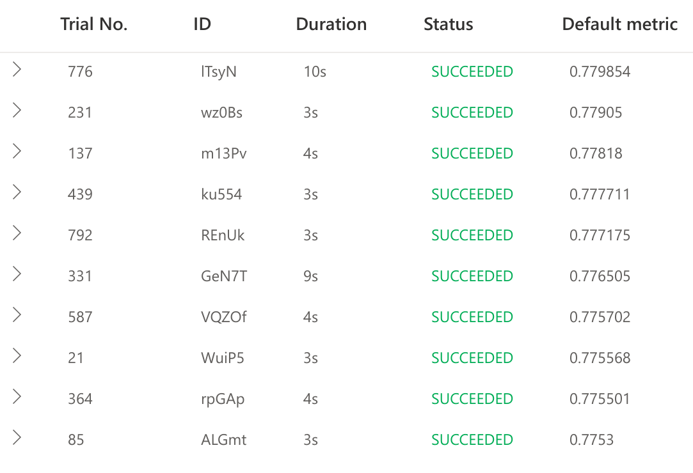
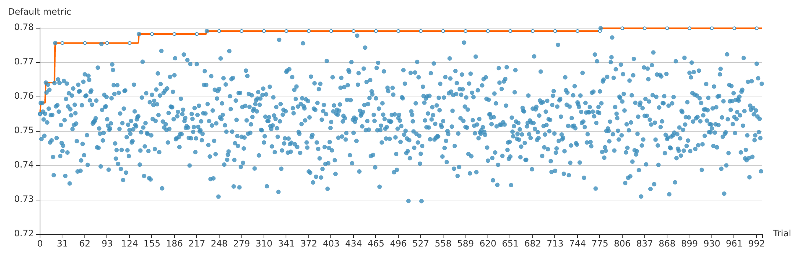
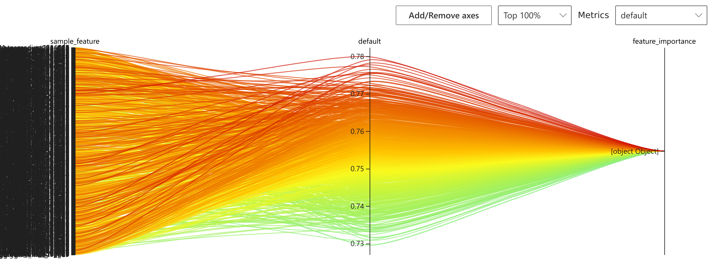

<<<<<<< HEAD
# Task3 进阶任务 Feature Engineering 实验报告

- [x] [Task3.1实验报告](./Task3.1/README.md)
- [x] [Task3.2.1实验报告](./Task3.2/Task3.2.1/README.md)
- [ ] [Task3.2.2实验报告](./Task3.2/Task3.2.2/README.md)
=======
# Task 3 进阶任务

## 特征工程简介

有这么一句话在业界广泛流传：

> 数据和特征决定了机器学习的上限，而模型和算法只是逼近这个上限而已。

数据是特征的来源，特征是给定算法下模型精确度的最大决定因素，可见提升特征质量意义重大。

特征工程(Feature Engineering)是机器学习的一个重要分支，指的是通过多种数据处理方法，从原始数据提取出若干个能优秀反映问题的特征，以提升最终算法与模型准确率的过程。

## 自动特征工程

自动特征工程是一种新技术，是机器学习发展的一大步。自动特征工程能够在降低时间成本的同时，生成更优秀的特征，从而构建出准确率更高的模型。

利用NNI的自动特征工程实现，我们通过简单调用函数便可实现特征工程的自动调优。

## 环境准备

- nni
- numpy
- lightgbm: 微软开源算法
- pandas: 基于python的数据分析强力工具
- sklearn: 集成了特征工程相关的常用函数

建议在conda环境下部署自动特征工程python环境。

此外，由于pandas版本更新，直接运行自带项目会报错，实际上只需修改`fe_util.py`中的`agg`参数类型即可，大致修改如下：

```diff
def aggregate(df, num_col, col, stat_list = AGGREGATE_TYPE):
-   agg_dict = {}
+   agg_list = []
    for i in stat_list:
-       agg_dict[('AGG_{}_{}_{}'.format(i, num_col, col)] = i
+       agg_list.append(('AGG_{}_{}_{}'.format(i, num_col, col), i))
-   agg_result = df.groupby([col])[num_col].agg(agg_dict)
+   agg.result = df.groupby([col])[num_col].agg(agg_list)
    r = left_merge(df, agg_result, on = [col])
    df = concat([df, r])
    return df
```

该修改已提交[pull request](https://github.com/SpongebBob/tabular_automl_NNI/pull/12)至原项目。

## 配置文件

### 配置搜索空间

NNI的自动特征工程支持count、crosscount、aggregate等一阶与二阶特征运算，配置搜索空间时只需按json格式填写搜索范围。具体填写方法以项目示例搜索空间为例：

```json
{
    "count":[
        "C1","C2","C3","C4","C5","C6","C7","C8","C9","C10",
        "C11","C12","C13","C14","C15","C16","C17","C18","C19",
        "C20","C21","C22","C23","C24","C25","C26"
    ],
    "aggregate":[
        ["I9","I10","I11","I12"],
        [
            "C1","C2","C3","C4","C5","C6","C7","C8","C9","C10",
            "C11","C12","C13","C14","C15","C16","C17","C18","C19",
            "C20","C21","C22","C23","C24","C25","C26"
        ]
    ],
    "crosscount":[
        [
            "C1","C2","C3","C4","C5","C6","C7","C8","C9","C10",
            "C11","C12","C13","C14","C15","C16","C17","C18","C19",
            "C20","C21","C22","C23","C24","C25","C26"
        ],
        [
            "C1","C2","C3","C4","C5","C6","C7","C8","C9","C10",
            "C11","C12","C13","C14","C15","C16","C17","C18","C19",
            "C20","C21","C22","C23","C24","C25","C26"
        ]
    ]
}
```

### 导入tuner

导入自动特征工程的tuner时，需要在`config.yml`中的`tuner`项添加相关信息，其他地方正常填写即可。

```yaml
tuner:
  codeDir: .
  classFileName: autofe_tuner.py
  className: AutoFETuner
  classArgs:
    optimize_mode: maximize
```

## 代码

Tuner在生成的搜索空间中随机选取一定数量的feature组合，通过`nni.get_next_parameter()`的接口，以dict的形式返回给单次trial。经一系列处理后运行lightGBM算法，得到最终以AUC形式呈现的结果。

调用代码主体部分如下：

```python
# get parameter from tuner
RECEIVED_PARAMS = nni.get_next_parameter()
logger.info("Received params:\n", RECEIVED_PARAMS)

# get sample column from parameter
df = pd.read_csv(file_name)
if 'sample_feature' in RECEIVED_PARAMS.keys():
    sample_col = RECEIVED_PARAMS['sample_feature']
else:
    sample_col = []

# df: raw feaure + sample_feature
df = name2feature(df, sample_col, target_name)
feature_imp, val_score = lgb_model_train(df, _epoch=1000, target_name=target_name,id_index=id_index)

# report result to nni
nni.report_final_result({
    "default":val_score, 
    "feature_importance":feature_imp
})
```

## 项目示例运行结果

### Overview



### Top 10 Trials



### Default Metric



### Hyper-parameter



### Feature Importance of Top 1 Trial

```
         feature_name  split  ...  split_percent  feature_score
5                  I6     39  ...      11.504425       0.145729
4                  I5     20  ...       5.899705       0.067777
85     AGG_max_I9_C17     14  ...       4.129794       0.053053
76      count_C18_C23     11  ...       3.244838       0.031225
43   AGG_mean_I11_C16      9  ...       2.654867       0.029425
..                ...    ...  ...            ...            ...
86    AGG_var_I11_C25      0  ...       0.000000       0.000000
82      count_C12_C20      0  ...       0.000000       0.000000
80       count_C1_C17      0  ...       0.000000       0.000000
77       count_C1_C23      0  ...       0.000000       0.000000
100     count_C15_C21      0  ...       0.000000       0.000000

[162 rows x 6 columns]
```

若想要查询某一次trial的feature importance，只需在WebUI中按下Copy as json，再代入原程序运行就可以获得了。

## heart数据集运行结果

[数据集地址](http://archive.ics.uci.edu/ml/datasets/Statlog+%28Heart%29)

heart数据集收集了中老年人是否患心脏病的270条数据，每条数据有13条属性，本质上是一个二分类问题的数据。

我们希望通过特征工程，从数据中挖掘出心脏病患病与其他事件的相关性，从庞杂的数据中得出结论。

在使用过程中，需要修改LightGBM算法的`min_data`参数为数据个数的因数，相应修改可在[原项目pull request](https://github.com/SpongebBob/tabular_automl_NNI/pull/12)中查看。

搜索空间根据本人的理解进行了小调整，因此会与原项目数据不同。

在本人的机器上，初始AUC为0.932367，使用了NNI自动特征工程之后，AUC上升到了0.97343，比原始精确度高出许多，也提高了原项目中0.9501的上限。

### Overview


### Top 10 Trials


### Default Metric


### Hyper-parameter


### Feature Importance of Top 1 Trial

```
                     feature_name  split  ...  split_percent  feature_score
113          count_chest-pain_sex      4  ...       9.302326       0.197441
37      AGG_var_chest-pain_hr-max      5  ...      11.627907       0.083669
53         AGG_median_age_vessels      3  ...       6.976744       0.075381
0                             age      3  ...       6.976744       0.058558
12                           thal      2  ...       4.651163       0.056385
..                            ...    ...  ...            ...            ...
54            AGG_max_sex_vessels      0  ...       0.000000       0.000000
52   AGG_median_chest-pain_hr-max      0  ...       0.000000       0.000000
51     AGG_median_bs-fasting_thal      0  ...       0.000000       0.000000
50       AGG_mean_age_cholesterol      0  ...       0.000000       0.000000
138            AGG_var_sex_hr-max      0  ...       0.000000       0.000000

[139 rows x 6 columns]

```
>>>>>>> master
