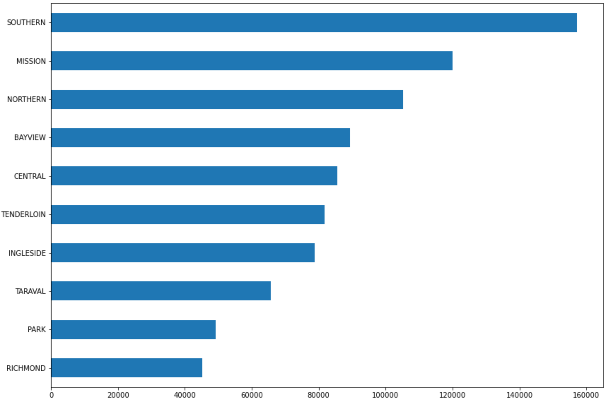
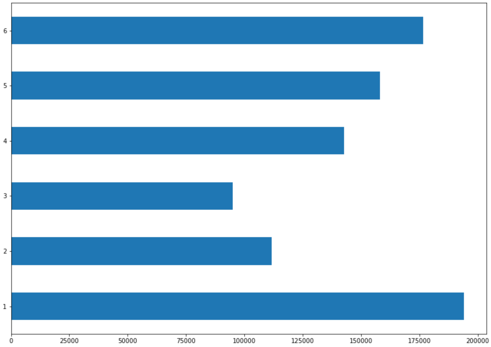
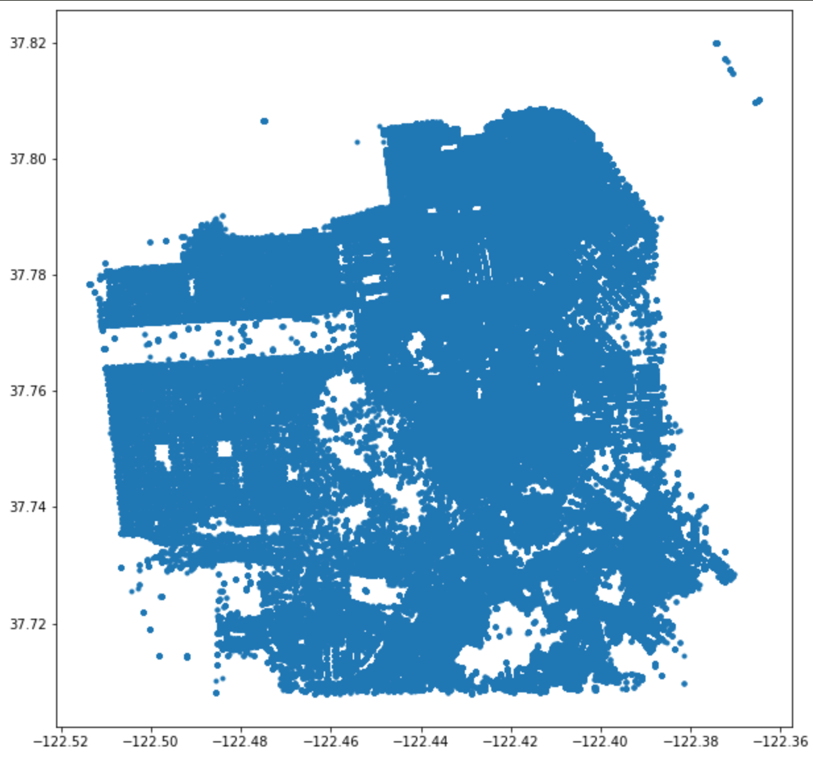

# Task 3.2.1 表格型数据的进阶任务

## 电影票房预测：TMDB Box Office Prediction

### 特征处理

首先，可以发现`belongs-to-collection`，`homepage`等特征存在缺失值，可根据具体数据类型使用不同策略填补缺失值，例如json数据填补`'[]'`，`runtime`用中位数填补等等。

其次，数据中存在异常值，需要人工删去异常数据或对异常数据进行填补，在这种时候，箱型图是很重要的工具。`budget`特征中，前25%的数据均是0，必然是异常数据，解决方案之一是用剩余`budget`数据的中位数来对其进行填补。`runtime`特征中存在338分钟的超长电影，打乱了`runtime`的规则分布，我们选择将该条数据从训练集中删去。

`poster-path`、`imdb-id`特征一个是图片链接，一个是id，对模型没有任何直接关系，直接删去。

在两个数据中，`status`特征99.8%的数据都是Released，那么这个特征根本不能提高分类精确度，因此可以直接删去。

`release-date`为常见的时间序列特征，通过`pd.DatetimeIndex`类型可以方便地提取年、月、日等新特征。

同时，在直方图中可以观察出`revenue`和`budget`数据的分布不均匀，可以通过`np.log1p`进行平滑处理，这样的预测结果比较符合正态分布，预测准确度能够提高。最终预测的`log-revenue`通过`np.exp1m`可还原回正常数据。

`cast`，`crew`，`belongs-to-collection`等特征是以json格式存储的，对数据中json的解析，`ast.literal_eval`能比较方便地完成解析任务。[参考链接](https://www.kaggle.com/c/tmdb-box-office-prediction/discussion/80045)

对于`cast`，`crew`这两个特殊的特征，可以符合实际情况，构造出主演，导演，制片人等有关信息，并且可以对这些信息根据票房高低进行排序，根据主演、导演的排名构造特征，这样的特征对最终所预测的票房相关性较强。另一种方法是使用词向量进行特征提取，后续可以进行尝试。

详细的手动特征处理过程可查看[tmdb-box-office-prediction.ipynb](./task3.2.1/tmdb-box-office-prediction/tmdb-box-office-prediction.ipynb)。

### 人工构造特征

基于先验知识，大制片厂参与制作，有明星演员，有明星导演的电影，票房一般会比较高。我们可以预先统计出演员、导演、制片厂的排名榜，然后通过这些关键要素的计数多少或存在与否构建新特征。

很多特征中，特征中所包含的元素越多，票房有比较大的几率倾向于越高，如`spoken-languages`，`genres`等特征。我们便可以构造count类型的新特征。

最终提交结果的loss是2.13(680/1395)，误差可接受，但有待进一步优化。

### 使用NNI自动特征工程

NNI集成了GradientFeatureSelector，该算法能在大数据集上缩小特征范围并找到高阶相关性，提升机器学习的效果与性能。

NNI的GradientFeatureSelector使用方法与sklearn模型大致相同：

```python
from nni.feature_engineering.gradient_selector import FeatureGradientSelector

selector = FeatureGradientSelector(n_features=20)
selector.fit(X_train, y_train)
print(selector.get_selected_features())
```

相关调用NNI自动特征工具的代码包含在对应的jupyter notebook文件中。

### 最终结果

在NNI的帮助下，当NNI特征选择器选择16个特征并且使用`GradientBoostingRegressor`时，取得了较好的提交结果。

最终提交结果的最好loss是2.09(621/1395)，在原来特征处理的基础上得到了提升。个人推测NNI特征选择器在本题效果不明显的原因是没有在手动特征处理部分提取和构造出足够多的特征，导致了选择空间较小，提升空间也比较受限。

## 旧金山犯罪分类：San Francisco Crime Classification

### 原始特征

该数据的特征相对较少，特征的处理也并不会想上一道题一样繁琐，不过相应的，针对特征的处理则需要更多的技巧。这道题需要做到39个类别的多分类任务，如果对高阶特征的提取不够充分，效果则会比较一般。

给出的特征中，除了`Descript`和`Resolution`之外的特征都很重要，我们逐步分析：

首先，不同的警区，犯罪案件的发生率是不同的，有些警区所在的地区是犯罪高发地。可以通过数据可视化看出：



可以看出：南部警区犯罪数量明显高于其他警区，Mission和北方警区犯罪数量也相对较多。

信息量较大的还有日期特征，从中可以查看一天中具体时间段的犯罪数量的分布。在这里我们将一天从0点到24点分为6个时间段可视化结果如下：



可以看出，在1代表的凌晨和6代表的夜晚这两个时间段内，犯罪数量相对其他的一个时间段都会高。

### 特征处理

`X`，`Y`两个特征中，在测试集发现经度为-120.5，纬度为90的异常特征，我们分别使用经纬度的中位数进行替换。替换后的散点图如下：



替换后可通过`sklearn.preprocessing.StandardScaler`，对数据进行标准化处理，这样更方便模型进行预测。

### 人工构造特征

对时间序列特征，提取出年、月、日、季度、小时、星期等子特征。并使用one-hot编码展开。

发现地址中具有规律，可根据地址最后两个大写字母种类的不同，构造关于地址的特征。

模型方面，我们使用随机森林进行回归，准确率为27.5%左右，有待提高。

详细步骤可查看[sf-crime.ipynb](./task3.2.1/sf-crime/sf-crime.ipynb)

### 使用NNI

同样使用NNI的`GradientFeatureSelector`，从构造出的特征中选取出了18个特征。

使用了NNI的特征选择器后，使用lightGBM算法构建模型，在验证集上的multiloss是2.32，相对原来有一定提高。

使用随机森林模型进行二分类，最优达到了30%的准确率。

### 最终结果

最终提交的模型在测试集上的结果不尽人意，在kaggle上只排到了75%左右，这说明最终模型的泛化效果并不够好，无法很好地完成39种类别的分类任务。

由于对特征工程的认识有限，在特征的处理上只实现了自己的处理思路，这可能也导致我们的模型表现不够优秀。


## 土壤属性预测：Africa Soil Property Prediction Challenge

multi-label的回归任务其实可以拆分为多个单label的回归任务，通过多次构建模型进行回归来预测各个label的值。

由于原代码只支持二分类任务，这里为了实现multi-label的回归任务，使用了以`lightgbm.LGBMRegressor`为内置结构的`sklearn.multioutput.MultiOutputRegressor`。[参考链接](https://stackoverflow.com/questions/52648383/how-to-get-coefficients-and-feature-importances-from-multioutputregressor)

### 原始特征

原始特征均进行过标准化处理，除了`Depth`特征可以将字符串变化为01编码，其他特征没有进一步处理的必要。

### 手动选择建立模型

使用了sklearn中贝叶斯线性回归模型（BayesianRidge），通过做5次模型的回归，最终kaggle上的loss为0.46489，拟合效果优秀。

详细步骤可查看[afsis-soil-properties](task3.2.1/afsis-soil-properties/soil.ipynb)

### 使用NNI AutoFE工具

该题目比较特殊，该题目中，绝大部分的特征描述的是针对特定波长的光的吸收能力。

理论上各特征的重要程度并无较大差别，更多的特征往往能够得到更高的预测精确度，在这些特征中进行重要性排序并进行特征选择的意义相对来说不是很大。所以经过权衡考虑后，我们决定跳过使用NNI进一步提升的步骤。

## 任务总结

在Task3.2.1的任务中，本小组从零开始学习了特征工程的有关知识，并学会了对常用表格特征的提取与新特征的构造方式，最后还尝试了通过使用NNI的特征工程工具优化模型性能。

由于学习时间较短，水平有限，特征提取与模型训练也没有能做到最好，也没能发挥出NNI特征工程工具的真正效果，希望在日后的学习中能够不断有所长进。
