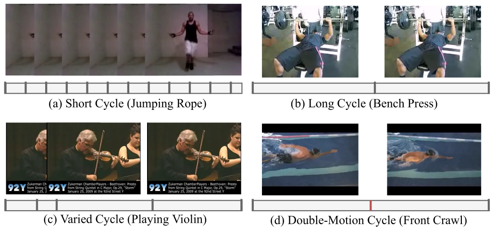
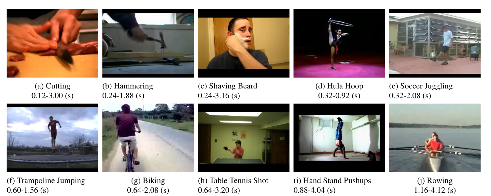

# Task 4 自主任务启动报告

## 项目介绍

本小组的项目主题为基于视频内容的重复计数工作。

该项目来自学校计算机视觉实验室，并已在CVPR2020上发表，论文名称为[Context-aware and Scale-insensitive Temporal Repetition Counting](https://openaccess.thecvf.com/content_CVPR_2020/papers/Zhang_Context-Aware_and_Scale-Insensitive_Temporal_Repetition_Counting_CVPR_2020_paper.pdf)，项目代码已开源至[GitHub项目](https://github.com/Xiaodomgdomg/Deep-Temporal-Repetition-Counting)。

重复计数旨在最大程度地估计给定视频内容中动作的循环次数。该计数具有实际应用价值，如健身运动中举哑铃、深蹲、俯卧撑计数，比赛项目中的跳绳计数等。

现有的基于深度学习的重复计数方法大多固定了循环的时间范围，然而实际样本中，循环周期经常有较大的变化，这样的方法在实际中并不适用。

此外，如上图所示，现实生活中也存在以(c)为代表的周期可变循环和以(d)为代表的对称性循环。简单的计数方法无法满足对此类样本的需求。

该论文提出的方法基于两个前提：

1. 不同的循环，长度固然难以预测，然而一旦大致确定了循环长度，可以通过回归的方法进行修正。
2. 确定循环长度不能只依靠当前片段，还需要前后的情景感知。

分别针对上述两点，论文提出了两个核心思路：

1. 提出一个由逐步精确的循环长度回归方法。
2. 提出一个双向的循环周期长度估计方法。

此外，如图，该论文基于UCF101数据集创建出了UCFRep框架，可用于循环计数的训练与测试。

更多细节可查阅原论文。

## 项目目标

通过使用NNI，对回归算法内置模型进行调优，使得模型提取出更加有context-aware性质的features，进一步降低mean absolute error(MAE)，提高计数的准确度。

## 项目规划

### 复现结果

第一阶段是配置好数据集，跑通项目代码，使用论文中的配置，复现论文中的结果。

### 超参调优

第二阶段是尝试改变超参，通过配置搜索空间，使用NNI的超参调优功能，尝试提高模型的精确度。

### 架构搜索

若超参调优结果提升不大，将进行第三阶段：使用NNI的NAS功能进行调整，尝试搜索出更优秀的模型，提高精确度，获得更优的结果。

## 实施方案

### 方案一

不改变神经网络大体架构，仅通过微调超参和微调网络结构，提高回归任务的精确度。

### 方案二

方案二为备选方案。

运用NNI的神经网络架构搜索功能，尝试不同的神经网络，重新生成一套效果更好的模型。

